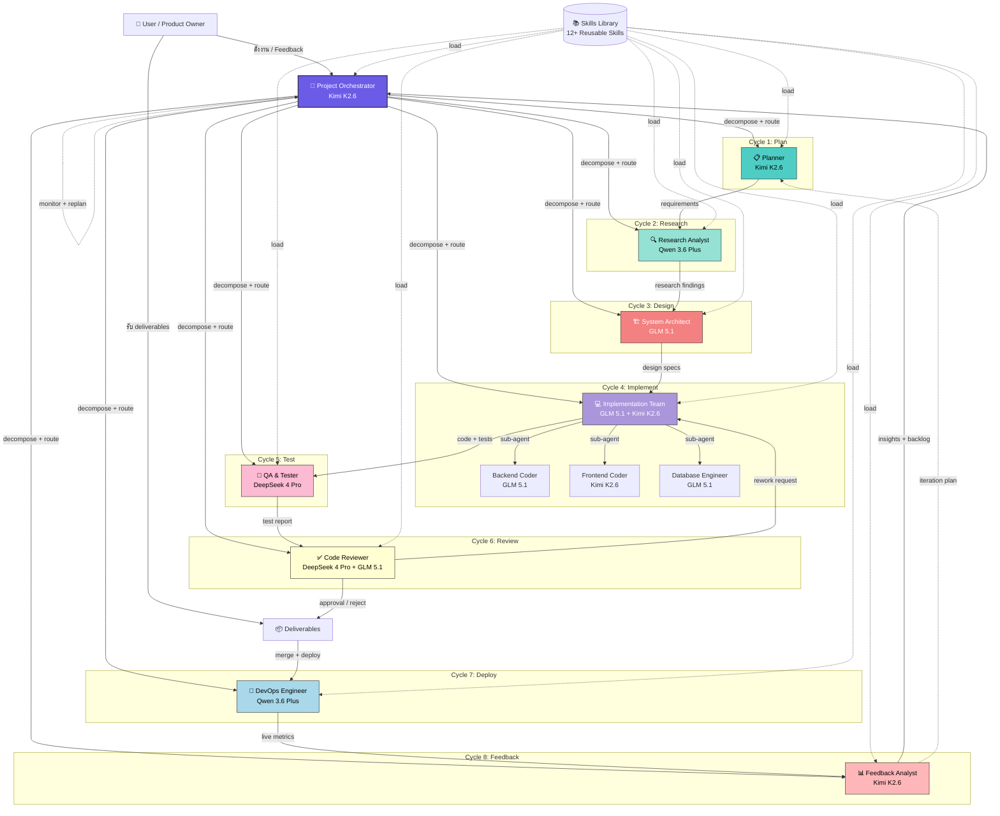

# OpenCode Go — Multi-Agent Work Cycle Architecture
## PEAK Alternative Project | Iterative Development Workflow

> **Version:** 1.0  
> **Target:** OpenCode Ensemble v0.13.1 + OpenCode Go  
> **Models:** Kimi K2.6 (Primary), GLM 5.1, Qwen 3.6 Plus, DeepSeek 4 Pro  
> **Cycle:** 8-Step Iterative Workflow (Plan → Research → Design → Build → Test → Review → Deploy → Feedback)

---

## 1. Overall Architecture

### 1.1 System Diagram (Mermaid)



### 1.2 ASCII Flow Diagram

```
┌─────────────────────────────────────────────────────────────────────────────┐
│                         8-STEP ITERATIVE CYCLE                               │
│                    (สังเกตุลูปศร feedback กลับไป Plan)                        │
└─────────────────────────────────────────────────────────────────────────────┘

   ┌──────────┐     ┌──────────┐     ┌──────────┐     ┌──────────┐
   │  1.PLAN  │────▶│ 2.RESEARCH│────▶│ 3.DESIGN │────▶│ 4.BUILD  │
   │  Planner │     │  Analyst  │     │ Architect│     │  Coders  │
   │Kimi K2.6 │     │Qwen 3.6+ │     │ GLM 5.1  │     │GLM+Kimi  │
   └──────────┘     └──────────┘     └──────────┘     └──────────┘
         ▲                                                │
         │                                                ▼
   ┌──────────┐     ┌──────────┐     ┌──────────┐     ┌──────────┐
   │ 8.FEEDBACK│◀────│ 7.DEPLOY │◀────│ 6.REVIEW │◀────│  5.TEST  │
   │  Analyst  │     │  DevOps  │     │ Reviewer │     │   QA     │
   │Kimi K2.6 │     │Qwen 3.6+ │     │DS4P+GLM  │     │ DeepSeek │
   └──────────┘     └──────────┘     └──────────┘     └──────────┘

   ═══════════════════════════════════════════════════════════════════
   ORCHESTRATOR (Kimi K2.6): ควบคุมจังหวะ + Decompose tasks + Quality Gate
   ═══════════════════════════════════════════════════════════════════
```

### 1.3 Cycle Explanation

1. **Plan** → Orchestrator รับ requirement จาก User → ส่ง Planner วิเคราะห์ scope
2. **Research** → Research Analyst ค้นคว้า technical landscape, competitor, best practices
3. **Design** → System Architect ออกแบบ schema, API contract, component tree
4. **Build** → Implementation Team (Backend + Frontend + DB) ทำงานขนานกัน
5. **Test** → QA รัน unit test, integration test, compliance check
6. **Review** → Code Reviewer ตรวจ quality, security, performance
7. **Deploy** → DevOps build Docker image, deploy ขึ้น VPS, verify health check
8. **Feedback** → Feedback Analyst รวม metrics, user feedback, สร้าง backlog รอบถัดไป

**สังเกต:** ลูปศรจาก Feedback → Plan คือจุดสำคัญที่ทำให้เป็น **Iterative Cycle** ไม่ใช่ Waterfall

---

## 2. Core Agents (8 Agents + Orchestrator)

### 2.0 Project Orchestrator (Kimi K2.6)

| Attribute | Value |
|-----------|-------|
| **Role** | Master Coordinator & Quality Gate |
| **Primary Model** | `opencode-go/kimi-k2.6` |
| **Backup Model** | `opencode-go/glm-5.1` |
| **Why Kimi K2.6?** | ยอดเยี่ยมใน agentic workflows, multi-step tool calling, sub-agent coordination, long-horizon planning, parallelism handling |

**Responsibilities:**
- รับ requirement จาก User → decompose เป็น atomic tasks
- Route tasks ไปยัง specialist agent ที่เหมาะสม
- ควบคุม cycle flow (ไม่ให้ Build เริ่มก่อน Design เสร็จ)
- Quality Gate: ตรวจสอบ deliverables ทุกขั้นก่อนผ่านไป cycle ถัดไป
- Conflict resolution: แก้ไขเมื่อ agents ทำงานทับซ้อนกัน
- Context compaction: สรุป context ระหว่าง cycles เพื่อไม่ให้เกิน window

**Interaction Pattern:**
```
User → Orchestrator: "สร้างระบบ Quotation ใหม่"
Orchestrator → Planner: "วิเคราะห์ requirement Quotation module"
Planner → Orchestrator: "Scope: 5 endpoints, 3 components, 2 DB tables"
Orchestrator → Researcher: "ค้นหา best practices สำหรับ quotation workflow"
Researcher → Orchestrator: "แนะนำ state machine: Draft → Sent → Accepted → Converted"
Orchestrator → Architect: "ออกแบบ schema + API ตาม research findings"
... (cycle ดำเนินต่อ)
```

**Prompt Template (System Prompt):**
```
You are the Project Orchestrator for a Thai cloud accounting SaaS (PEAK Alternative).
Your job is to coordinate 8 specialist agents through an iterative development cycle.

RULES:
1. ALWAYS decompose user requests into atomic tasks before routing
2. NEVER let a cycle start before its predecessor completes quality gate
3. Maintain a shared state board: {cycle_status, active_agents, blocked_agents, completed_tasks}
4. When an agent reports completion, verify deliverable quality before marking cycle complete
5. If an agent fails 3 times, escalate to backup model or human
6. Keep context summary under 4000 tokens between cycles
7. All communication in Thai (technical terms in English is OK)

CYCLE ORDER: Plan → Research → Design → Build → Test → Review → Deploy → Feedback → (loop)
```

---

### 2.1 Planner (Cycle 1: Requirement Gathering & Planning)

| Attribute | Value |
|-----------|-------|
| **Role** | Scope Analyzer & Task Decomposer |
| **Primary Model** | `opencode-go/kimi-k2.6` |
| **Backup Model** | `opencode-go/glm-5.1` |
| **Why Kimi K2.6?** | Planning + coordination + การเข้าใจ business context แบบ multi-step ทำให้ scope analysis แม่นยำ |

**Responsibilities:**
- วิเคราะห์ user requirement → แยกเป็น functional / non-functional requirements
- ประเมิน effort, risk, dependency
- สร้าง task breakdown structure (TBS)
- กำหนด Definition of Done (DoD) สำหรับแต่ละ task
- สร้าง acceptance criteria

**Skills Used:**
- `spec-driven-development`
- `task-decomposition`
- `risk-assessment`
- `acceptance-criteria-writer`

**Output:** `/docs/plans/{feature-name}-plan.md`

---

### 2.2 Research Analyst (Cycle 2: Research & Analysis)

| Attribute | Value |
|-----------|-------|
| **Role** | Technical Investigator & Best Practices Advisor |
| **Primary Model** | `opencode-go/qwen-3.6` |
| **Backup Model** | `opencode-go/glm-5.1` |
| **Why Qwen 3.6?** | Large context (1M tokens) อ่าน codebase ทั้งระบบได้, วิเคราะห์ multi-file เก่ง, เหมาะกับ research ที่ต้อง cross-reference หลายแหล่ง |

**Responsibilities:**
- ค้นคว้า Thai accounting standards (TFRS, Revenue Dept rules)
- วิเคราะห์ competitor (PEAK) features จาก screenshots
- ค้นหา best practices สำหรับ tech stack (FastAPI, React, PostgreSQL)
- วิเคราะห์ existing codebase ว่ามีอะไรแล้วบ้าง
- สรุป findings เป็นรายงาน

**Skills Used:**
- `competitor-profiling`
- `codebase-explorer`
- `thai-acc-specialist`
- `tech-stack-research`

**Output:** `/docs/research/{feature-name}-research.md`

---

### 2.3 System Architect (Cycle 3: Design & Architecture)

| Attribute | Value |
|-----------|-------|
| **Role** | Technical Designer & Schema Architect |
| **Primary Model** | `opencode-go/glm-5.1` |
| **Backup Model** | `opencode-go/kimi-k2.6` |
| **Why GLM 5.1?** | Coding specialist, clean code output, strong reasoning, ออกแบบ schema และ API contracts ได้สะอาดมาก |

**Responsibilities:**
- ออกแบบ database schema (ER diagram)
- ออกแบบ API contracts (OpenAPI / REST)
- ออกแบบ component tree (frontend)
- กำหนด data flow และ event-driven patterns
- ออกแบบ state machines สำหรับ document workflows

**Skills Used:**
- `schema-design`
- `api-contract-design`
- `component-architecture`
- `state-machine-design`

**Output:** `/docs/design/{feature-name}-design.md`

---

### 2.4 Implementation Team (Cycle 4: Build)

#### 2.4.1 Backend Coder

| Attribute | Value |
|-----------|-------|
| **Role** | API & Business Logic Implementer |
| **Primary Model** | `opencode-go/glm-5.1` |
| **Backup Model** | `opencode-go/kimi-k2.6` |
| **Why GLM 5.1?** | SWE-Bench leader, clean Python code, strong reasoning ใน business logic |

**Responsibilities:**
- Implement FastAPI endpoints
- Write business logic (tax calculations, FIFO, GL posting)
- Implement database models & queries
- Write docstrings และ type hints

#### 2.4.2 Frontend Coder

| Attribute | Value |
|-----------|-------|
| **Role** | UI/UX Component Implementer |
| **Primary Model** | `opencode-go/kimi-k2.6` |
| **Backup Model** | `opencode-go/qwen-3.6` |
| **Why Kimi K2.6?** | ดีที่สุดสำหรับ frontend/visual tasks, component composition, React hooks, Tailwind |

**Responsibilities:**
- Implement React components ตาม design.md
- Build responsive layouts
- Integrate with backend APIs
- Implement Thai localization

#### 2.4.3 Database Engineer

| Attribute | Value |
|-----------|-------|
| **Role** | Schema & Migration Implementer |
| **Primary Model** | `opencode-go/glm-5.1` |
| **Backup Model** | `opencode-go/qwen-3.6` |
| **Why GLM 5.1?** | Clean SQL, understands indexing strategy, migration best practices |

**Responsibilities:**
- Write migration files (Alembic / Prisma)
- Create seed data
- Optimize indexes
- Write database constraints

**Skills Used:**
- `fastapi-development`
- `react-frontend`
- `database-migration`
- `thai-acc-workflow`

**Output:** `/backend/src/...`, `/frontend/src/...`, `/backend/migrations/...`

---

### 2.5 QA & Tester (Cycle 5: Testing)

| Attribute | Value |
|-----------|-------|
| **Role** | Quality Assurance & Test Engineer |
| **Primary Model** | `opencode-go/deepseek-4-pro` |
| **Backup Model** | `opencode-go/glm-5.1` |
| **Why DeepSeek 4 Pro?** | ถูกและเร็ว สำหรับ mechanical work อย่างการเขียน test cases จำนวนมาก, code review pattern matching, batch processing |

**Responsibilities:**
- Write unit tests (pytest)
- Write integration tests
- Test edge cases (tax calculations, FIFO, WHT)
- Validate Thai accounting compliance
- Run test suites และ report coverage

**Skills Used:**
- `pytest-testing`
- `integration-testing`
- `compliance-validation`
- `edge-case-hunter`

**Output:** `/backend/tests/...`, coverage reports

---

### 2.6 Code Reviewer (Cycle 6: Review & Optimization)

| Attribute | Value |
|-----------|-------|
| **Role** | Quality Gate & Performance Optimizer |
| **Primary Model** | `opencode-go/deepseek-4-pro` (initial scan) + `opencode-go/glm-5.1` (deep review) |
| **Backup Model** | `opencode-go/kimi-k2.6` |
| **Why Dual Model?** | DeepSeek 4 Pro ทำ initial scan เร็ว (catch obvious issues) → GLM 5.1 ทำ deep review (logic, architecture, performance) |

**Responsibilities:**
- Review code quality (readability, maintainability)
- Check security vulnerabilities (OWASP)
- Validate API contract compliance
- Optimize performance (N+1 queries, re-renders)
- Verify test coverage
- อนุมัติหรือ reject พร้อม feedback

**Skills Used:**
- `code-review-and-quality`
- `security-and-hardening`
- `performance-optimization`
- `thai-acc-reviewer`

**Output:** Review comments, approval/rejection decision

---

### 2.7 DevOps Engineer (Cycle 7: Deployment & Monitoring)

| Attribute | Value |
|-----------|-------|
| **Role** | Infrastructure & Deployment Engineer |
| **Primary Model** | `opencode-go/qwen-3.6` |
| **Backup Model** | `opencode-go/glm-5.1` |
| **Why Qwen 3.6?** | Large context อ่าน config files ทั้งระบบได้ (Dockerfile, docker-compose, nginx, CI/CD), multi-file refactor เก่ง |

**Responsibilities:**
- Build Docker images
- Update docker-compose
- Deploy ขึ้น VPS
- Configure nginx reverse proxy
- Set up health checks
- Configure logging (production.log)
- Database backup strategy

**Skills Used:**
- `docker-orchestration`
- `vps-deployment`
- `ci-cd-pipeline`
- `monitoring-setup`

**Output:** Deployed application, infrastructure configs

---

### 2.8 Feedback Analyst (Cycle 8: Feedback & Iteration)

| Attribute | Value |
|-----------|-------|
| **Role** | Metrics Analyzer & Backlog Generator |
| **Primary Model** | `opencode-go/kimi-k2.6` |
| **Backup Model** | `opencode-go/glm-5.1` |
| **Why Kimi K2.6?** | Planning + coordination + การวิเคราะห์ patterns จาก feedback หลายแหล่ง → สร้าง actionable backlog |

**Responsibilities:**
- วิเคราะห์ production logs
- รวม user feedback
- วิเคราะห์ performance metrics
- สร้าง prioritized backlog สำหรับรอบถัดไป
- สรุป lessons learned

**Skills Used:**
- `log-analysis`
- `feedback-synthesis`
- `backlog-prioritization`
- `lessons-learned`

**Output:** `/docs/feedback/{cycle-id}-feedback.md`, updated backlog

---

## 3. Model Selection Matrix

| Agent | Primary | Backup | Rationale |
|-------|---------|--------|-----------|
| **Orchestrator** | Kimi K2.6 | GLM 5.1 | Agentic workflows, multi-step coordination, planning |
| **Planner** | Kimi K2.6 | GLM 5.1 | Business context understanding, task decomposition |
| **Research Analyst** | Qwen 3.6 | GLM 5.1 | Large context (1M), codebase analysis, multi-file research |
| **System Architect** | GLM 5.1 | Kimi K2.6 | Clean schema design, API contracts, reasoning |
| **Backend Coder** | GLM 5.1 | Kimi K2.6 | SWE-Bench leader, Python specialist |
| **Frontend Coder** | Kimi K2.6 | Qwen 3.6 | Visual tasks, React, Tailwind, component composition |
| **Database Engineer** | GLM 5.1 | Qwen 3.6 | Clean SQL, migrations, indexing |
| **QA & Tester** | DeepSeek 4 Pro | GLM 5.1 | Cheap batch processing, test case generation |
| **Code Reviewer** | DeepSeek 4 Pro + GLM 5.1 | Kimi K2.6 | Dual-pass: fast scan + deep review |
| **DevOps Engineer** | Qwen 3.6 | GLM 5.1 | Large config files, multi-file orchestration |
| **Feedback Analyst** | Kimi K2.6 | GLM 5.1 | Pattern analysis, backlog generation |

---

## 4. Skills Library (12+ Reusable Skills)

Skills ถูกออกแบบให้เป็น modular และ reusable โดยเก็บไว้ใน `/skills/{category}/SKILL.md`

### 4.1 Skill Registry

| # | Skill Name | Category | Assigned Model | File |
|---|-----------|----------|----------------|------|
| 1 | Spec-Driven Development | Plan | Kimi K2.6 | `skills/plan/SKILL.md` |
| 2 | Task Decomposition | Plan | Kimi K2.6 | `skills/plan/decomposition.md` |
| 3 | Competitor Profiling | Research | Qwen 3.6 | `skills/research/competitor.md` |
| 4 | Codebase Explorer | Research | Qwen 3.6 | `skills/research/codebase.md` |
| 5 | Schema Design | Design | GLM 5.1 | `skills/design/schema.md` |
| 6 | API Contract Design | Design | GLM 5.1 | `skills/design/api-contract.md` |
| 7 | FastAPI Development | Build | GLM 5.1 | `skills/build/fastapi.md` |
| 8 | React Frontend | Build | Kimi K2.6 | `skills/build/react.md` |
| 9 | Thai ACC Workflow | Build | GLM 5.1 | `skills/build/thai-workflow.md` |
| 10 | Pytest Testing | Test | DeepSeek 4 Pro | `skills/test/pytest.md` |
| 11 | Compliance Validation | Test | GLM 5.1 | `skills/test/compliance.md` |
| 12 | Code Review & Quality | Review | DeepSeek 4 Pro + GLM 5.1 | `skills/review/code-review.md` |
| 13 | Security Hardening | Review | GLM 5.1 | `skills/review/security.md` |
| 14 | VPS Deployment | Deploy | Qwen 3.6 | `skills/deploy/vps.md` |
| 15 | Feedback Synthesis | Feedback | Kimi K2.6 | `skills/feedback/synthesis.md` |

---

## 5. Orchestrator Deep Dive

### 5.1 State Board Format

The Orchestrator maintains a shared state board ที่ agents ทุกตัวเห็น:

```json
{
  "cycle_id": "cycle-001",
  "feature": "quotation-module",
  "status": "in_progress",
  "current_cycle": "build",
  "cycles": {
    "plan": { "status": "completed", "agent": "planner", "deliverable": "/docs/plans/quotation-plan.md" },
    "research": { "status": "completed", "agent": "researcher", "deliverable": "/docs/research/quotation-research.md" },
    "design": { "status": "completed", "agent": "architect", "deliverable": "/docs/design/quotation-design.md" },
    "build": { "status": "in_progress", "agent": "implementer", "sub_agents": ["backend", "frontend", "db"] },
    "test": { "status": "pending", "blocked_by": "build" },
    "review": { "status": "pending", "blocked_by": "test" },
    "deploy": { "status": "pending", "blocked_by": "review" },
    "feedback": { "status": "pending", "blocked_by": "deploy" }
  },
  "quality_gate": {
    "plan": "passed",
    "research": "passed",
    "design": "passed"
  },
  "context_summary": "Building quotation module with 5 API endpoints..."
}
```

### 5.2 Quality Gate Rules

| Cycle | Gate Condition | Auto-pass Criteria |
|-------|---------------|-------------------|
| Plan | มี TBS + DoD + acceptance criteria | ครบทุก section |
| Research | มี findings summary + source links | ครบทุก research question |
| Design | มี schema + API contract + component tree | All designs reviewed by architect |
| Build | All sub-agents report complete | Build passes without errors |
| Test | Test coverage >= 80% | All tests pass |
| Review | No critical/security issues | Reviewer approves |
| Deploy | Health check passes | 200 OK on all endpoints |
| Feedback | มี metrics + backlog items | Summary complete |

### 5.3 Error Recovery

```
IF agent fails:
  1. Retry with same agent (max 2 retries)
  2. IF still fails → switch to backup model
  3. IF backup fails → escalate to human
  4. Log failure reason → update risk register

IF cycle blocked > 30 min:
  1. Check agent status (stall detection)
  2. IF stalled → spawn replacement agent
  3. Notify human with options

IF quality gate fails:
  1. Return to previous cycle with feedback
  2. Do NOT advance to next cycle
  3. Update state board with rejection reason
```

---

## 6. Edge Cases & Best Practices

### 6.1 Context Window Management

- **Orchestrator:** สรุป context ระหว่าง cycles → เก็บแค่ state board + context summary (ไม่เกิน 4000 tokens)
- **Research Analyst (Qwen 3.6):** ใช้ large context (1M) อ่าน codebase ทั้งหมด → สรุป findings ก่อนส่งต่อ
- **Other agents:** รับแค่สรุปที่จำเป็นต่อ task ตัวเอง

### 6.2 Cost Optimization

| Strategy | Implementation |
|----------|---------------|
| **Tiered Models** | งานหนัก (plan, architect, frontend) → Kimi/GLM / งาน mechanical (test, review scan) → DeepSeek |
| **Parallel Sub-agents** | Backend + Frontend + DB ทำงานพร้อมกัน → ลด total time |
| **Early Exit** | ถ้า Quality Gate fail ตั้งแต่ cycle แรก → หยุดทันที ไม่เสีย cost cycle ต่อไป |
| **Context Caching** | เก็บ research findings + design specs ไว้ reuse ใน cycles ถัดไป |

### 6.3 Parallel Execution

```
Sequential (must wait):
  Plan → Research → Design → Build → Test → Review → Deploy → Feedback

Parallel (within Build cycle):
  Backend Coder ──┐
                  ├──▶ Integration Point
  Frontend Coder ─┤
                  │
  Database Engineer
```

### 6.4 Integration with OpenCode Tools

```json
// opencode.json
{
  "plugin": ["@hueyexe/opencode-ensemble@0.13.1"],
  "skills_dir": "./skills",
  "mcp_servers": {
    "postgres": { "command": "npx", "args": ["-y", "@modelcontextprotocol/server-postgres"] },
    "filesystem": { "command": "npx", "args": ["-y", "@modelcontextprotocol/server-filesystem", "/Users/tong/peak-acc"] }
  }
}
```

### 6.5 Security Considerations

- **RBAC:** Orchestrator ตรวจสอบ permissions ก่อน spawn agent
- **Audit Log:** บันทึกทุก action (who did what, when)
- **Secret Management:** API keys, DB passwords → เก็บใน `.env` ไม่ให้ agents เห็น
- **Sandbox:** DevOps agent deploy ลง staging ก่อน production เสมอ

---

## 7. Getting Started

### 7.1 Spawn Sequence

```
You: "สร้างระบบ Quotation ใหม่"

Step 1: Orchestrator รับ requirement → สร้าง state board
Step 2: Spawn Planner → วิเคราะห์ scope
Step 3: (Planner เสร็จ) → Spawn Research Analyst → ค้นคว้า
Step 4: (Research เสร็จ) → Spawn Architect → ออกแบบ
Step 5: (Design เสร็จ) → Spawn 3 sub-agents พร้อมกัน:
         - Backend Coder
         - Frontend Coder
         - Database Engineer
Step 6: (Build เสร็จ) → Spawn QA → ทดสอบ
Step 7: (Test pass) → Spawn Reviewer → ตรวจ code
Step 8: (Review pass) → Spawn DevOps → deploy
Step 9: (Deploy เสร็จ) → Spawn Feedback Analyst → สรุป
Step 10: Feedback → กลับไป Step 1 (รอบถัดไป)
```

### 7.2 Dashboard Monitoring

```
เปิด dashboard: http://localhost:4747

ดูได้:
- Agent cards (status, current task, sparklines)
- Task board (progress bar, dependencies)
- Activity feed (messages ระหว่าง agents)
- Timeline (spawns, completions, errors)
```

### 7.3 Commands

```bash
# Check team status
opencode
> "team_status"

# View specific agent
opencode
> "team_view({ member: 'backend' })"

# Merge changes
opencode
> "team_merge({ member: 'backend' })"

# Cleanup
opencode
> "team_cleanup"
```

---

## 8. File Structure

```
peak-acc/
├── .opencode/
│   ├── ensemble.json          # Agent model assignments
│   └── ARCHITECTURE.md        # This file
├── skills/
│   ├── plan/
│   │   ├── SKILL.md           # Spec-driven development
│   │   └── decomposition.md   # Task decomposition
│   ├── research/
│   │   ├── competitor.md      # Competitor profiling
│   │   └── codebase.md        # Codebase exploration
│   ├── design/
│   │   ├── schema.md          # Database schema design
│   │   └── api-contract.md    # API contract design
│   ├── build/
│   │   ├── fastapi.md         # FastAPI development
│   │   ├── react.md           # React frontend
│   │   └── thai-workflow.md   # Thai accounting workflow
│   ├── test/
│   │   ├── pytest.md          # Pytest testing
│   │   └── compliance.md      # Thai compliance validation
│   ├── review/
│   │   ├── code-review.md     # Code review & quality
│   │   └── security.md        # Security hardening
│   ├── deploy/
│   │   └── vps.md             # VPS deployment
│   └── feedback/
│       └── synthesis.md       # Feedback synthesis
├── docs/
│   ├── plans/                 # Cycle 1 outputs
│   ├── research/              # Cycle 2 outputs
│   ├── design/                # Cycle 3 outputs
│   └── feedback/              # Cycle 8 outputs
├── backend/
├── frontend/
└── opencode.json              # Plugin config
```

---

*สร้างสำหรับ OpenCode Go | PEAK Alternative Project | Iterative Multi-Agent Workflow*
